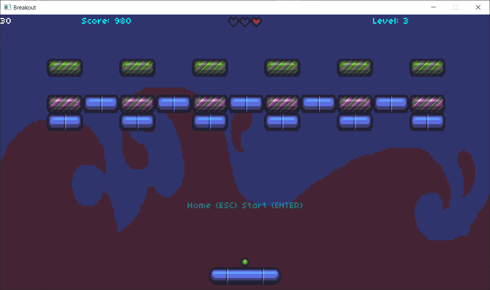
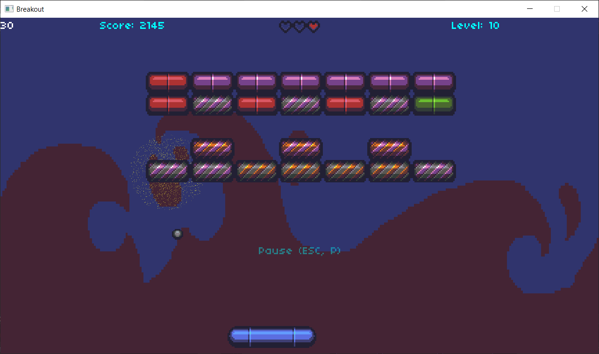
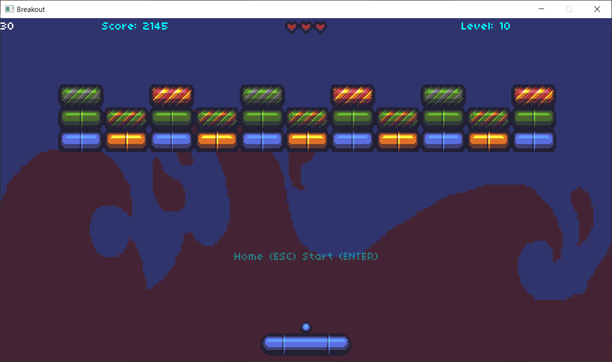
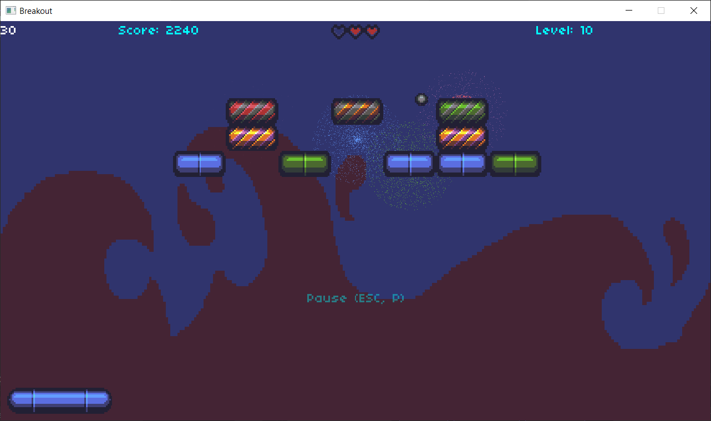

## BREAKOUT
This is my first game on windows. I made this game to learn the tricks of game making, this was never any serious game development project.
***
I learned it from this [CS50 Breakout tutorial from YouTube](https://youtube.com/watch?v=F86edI_EF3s&si=krurkwvqGG8Fir3d). In that tutorial they used **Lua** with **Love2D**, I had some past experience of game development with **C++** so, I developed my own game engine, called **Byte_Blitz_SFML**, with **SFML** and **C++**.
***
Some Screenshots from the game

***
I used [**Byte_Blitz_SFML v0.0.0 Release**](https://github.com/Tushar625/Byte_Blitz_SFML/releases/tag/v0.0.0) to make this game.